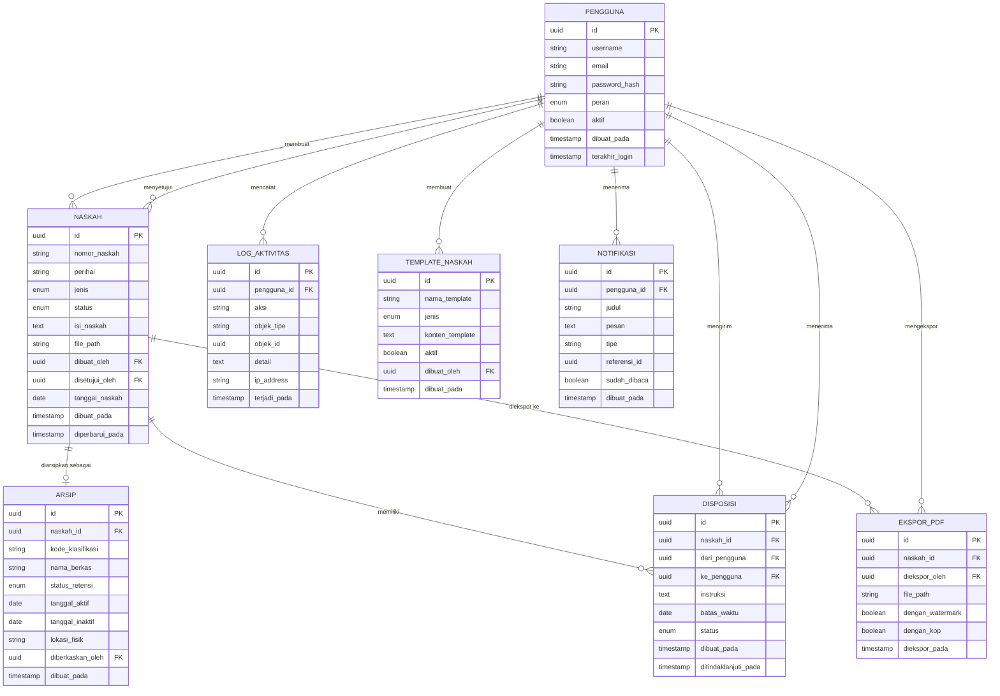
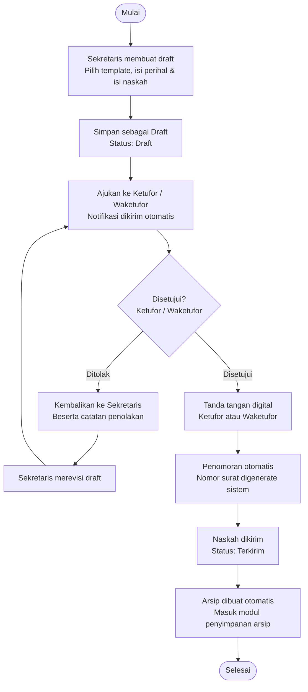
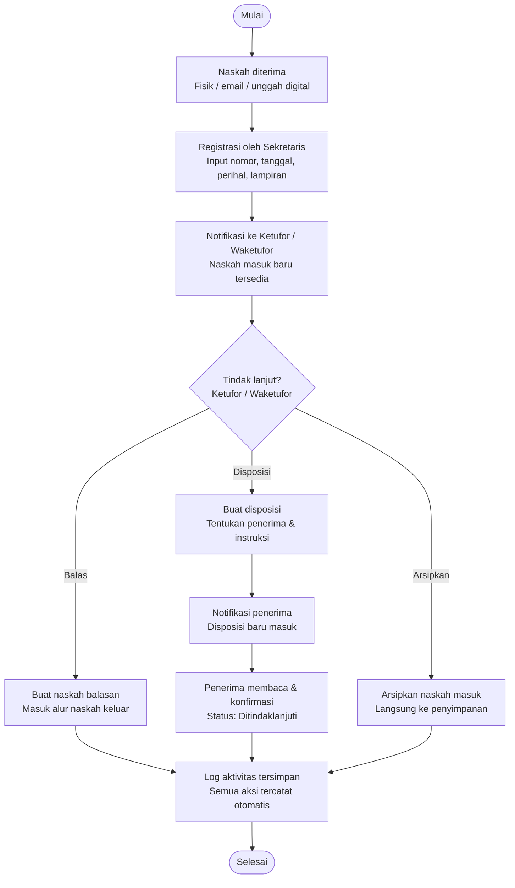
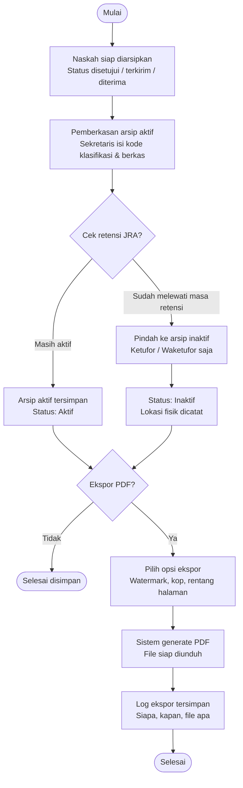

# Software Requirements Specification
## Sistem Pengarsipan & Ekstrak Dokumen PDF

> **Berbasis Referensi Aplikasi Srikandi ANRI**
>
> | | |
> |---|---|
> | **Versi** | 1.0 Draft |
> | **Tanggal** | Mei 2026 |
> | **Status** | Draft untuk Review Internal |

---

## Daftar Isi

1. [Pendahuluan](#1-pendahuluan)
   - 1.1 [Tujuan Dokumen](#11-tujuan-dokumen)
   - 1.2 [Ruang Lingkup](#12-ruang-lingkup)
   - 1.3 [Definisi dan Singkatan](#13-definisi-dan-singkatan)
2. [Gambaran Umum Sistem](#2-gambaran-umum-sistem)
   - 2.1 [Perspektif Produk](#21-perspektif-produk)
   - 2.2 [Fungsi Utama Sistem](#22-fungsi-utama-sistem)
   - 2.3 [Peran Pengguna](#23-peran-pengguna)
3. [Kebutuhan Fungsional](#3-kebutuhan-fungsional)
   - 3.1 [Modul Draft Naskah](#31-modul-draft-naskah)
   - 3.2 [Modul Naskah Keluar](#32-modul-naskah-keluar)
   - 3.3 [Modul Naskah Masuk](#33-modul-naskah-masuk)
   - 3.4 [Modul Disposisi](#34-modul-disposisi)
   - 3.5 [Modul Penyimpanan Arsip](#35-modul-penyimpanan-arsip)
   - 3.6 [Modul Ekspor PDF](#36-modul-ekspor-pdf)
   - 3.7 [Modul Pengaturan Sistem](#37-modul-pengaturan-sistem)
4. [Matriks Hak Akses](#4-matriks-hak-akses)
5. [Struktur Database (ERD)](#5-struktur-database-erd)
   - 5.1 [Entitas dan Atribut](#51-entitas-dan-atribut)
   - 5.2 [Relasi Antar Entitas](#52-relasi-antar-entitas)
   - 5.3 [Diagram ERD (Mermaid)](#53-diagram-erd-mermaid)
6. [Alur Kerja Sistem (Flowchart)](#6-alur-kerja-sistem-flowchart)
   - 6.1 [Alur Draft Naskah & Naskah Keluar](#61-alur-draft-naskah--naskah-keluar)
   - 6.2 [Alur Naskah Masuk & Disposisi](#62-alur-naskah-masuk--disposisi)
   - 6.3 [Alur Penyimpanan Arsip & Ekspor PDF](#63-alur-penyimpanan-arsip--ekspor-pdf)
7. [Kebutuhan Non-Fungsional](#7-kebutuhan-non-fungsional)
   - 7.1 [Keamanan](#71-keamanan)
   - 7.2 [Performa](#72-performa)
   - 7.3 [Ketersediaan](#73-ketersediaan)
   - 7.4 [Antarmuka Pengguna](#74-antarmuka-pengguna)
8. [Asumsi dan Keterbatasan](#8-asumsi-dan-keterbatasan)
9. [Riwayat Dokumen](#9-riwayat-dokumen)

---

## 1. Pendahuluan

### 1.1 Tujuan Dokumen

Dokumen Software Requirements Specification (SRS) ini menjabarkan kebutuhan fungsional dan non-fungsional untuk **Sistem Pengarsipan dan Ekstrak Dokumen PDF** milik organisasi. Sistem ini dirancang mengacu pada best practice aplikasi **Srikandi** (Sistem Informasi Kearsipan Dinamis Terintegrasi) yang dikembangkan oleh Arsip Nasional Republik Indonesia (ANRI).

Dokumen ini ditujukan sebagai acuan bagi:
- Tim pengembang dalam membangun sistem
- Pemangku kepentingan (Ketufor, Waketufor) dalam melakukan review
- Tim QA dalam menyusun skenario pengujian

### 1.2 Ruang Lingkup

Sistem mencakup seluruh siklus pengelolaan arsip dinamis organisasi, meliputi:

- Pembuatan dan pengelolaan draft naskah dinas
- Registrasi dan tindak lanjut naskah masuk
- Pengiriman naskah keluar dengan tanda tangan digital
- Pemberkasan dan penyimpanan arsip aktif serta inaktif
- Disposisi dan penelusuran tindak lanjut
- Ekspor dan cetak dokumen ke format PDF
- Manajemen hak akses berdasarkan peran (Ketufor, Waketufor, Sekretaris)

Sistem **tidak** mencakup:
- Integrasi real-time dengan sistem kearsipan pemerintah (ANRI/Srikandi pusat)
- Pengelolaan arsip dari organisasi lain (multi-tenant)
- Migrasi data dari sistem lama

### 1.3 Definisi dan Singkatan

| Istilah | Definisi |
|---------|----------|
| **SRS** | Software Requirements Specification — dokumen spesifikasi kebutuhan perangkat lunak |
| **Ketufor** | Ketua Forum — pengguna dengan level akses tertinggi dalam sistem |
| **Waketufor** | Wakil Ketua Forum — pengguna dengan level akses tinggi, setara Ketufor kecuali penghapusan arsip final |
| **Sekretaris** | Pengguna dengan akses terbatas untuk keperluan administrasi dan pemberkasan |
| **JRA** | Jadwal Retensi Arsip — jadwal yang memuat jangka simpan arsip aktif dan inaktif |
| **TTE** | Tanda Tangan Elektronik — tanda tangan digital yang sah secara hukum |
| **Naskah** | Dokumen atau surat dinas yang dikelola dalam sistem |
| **Pemberkasan** | Proses pengaturan dan pengelompokan arsip secara sistematis |
| **Disposisi** | Instruksi tindak lanjut atas naskah masuk dari pimpinan ke bawahan |
| **RBAC** | Role-Based Access Control — sistem kontrol akses berbasis peran pengguna |
| **ERD** | Entity Relationship Diagram — diagram relasi antar entitas database |

---

## 2. Gambaran Umum Sistem

### 2.1 Perspektif Produk

Sistem ini adalah **aplikasi web berbasis browser** yang dapat diakses dari desktop maupun perangkat mobile. Sistem berdiri sendiri (standalone) dan tidak memerlukan integrasi eksternal pada versi awal, namun dirancang agar mudah dihubungkan dengan sistem lain di masa mendatang (misalnya: email server untuk notifikasi, layanan TTE eksternal dari BSrE).

Sistem beroperasi sebagai aplikasi single-tenant yang melayani satu organisasi. Seluruh data tersimpan di server organisasi atau layanan cloud yang ditunjuk.

### 2.2 Fungsi Utama Sistem

1. Pengelolaan naskah: draft, naskah keluar, dan naskah masuk
2. Pemberkasan dan penyimpanan arsip aktif serta inaktif
3. Disposisi dan penelusuran tindak lanjut naskah
4. Ekspor dokumen ke PDF dengan opsi kop dan watermark
5. Manajemen akses berbasis peran (RBAC)
6. Log aktivitas dan audit trail lengkap
7. Notifikasi in-app dan email

### 2.3 Peran Pengguna

| Peran | Level Akses | Deskripsi |
|-------|-------------|-----------|
| **Ketufor** | Level 1 — Tertinggi | Akses penuh ke seluruh fitur sistem termasuk penghapusan arsip final dan manajemen pengguna |
| **Waketufor** | Level 2 — Tinggi | Akses hampir setara Ketufor. Dapat membuat, menyetujui, menandatangani, mengekspor. Tidak dapat menghapus arsip final |
| **Sekretaris** | Level 3 — Terbatas | Membuat draft, registrasi naskah masuk/keluar, pemberkasan arsip aktif. Tidak dapat menyetujui atau menandatangani dokumen |

---

## 3. Kebutuhan Fungsional

### 3.1 Modul Draft Naskah

#### 3.1.1 Pembuatan Draft

- Sistem menyediakan form pembuatan naskah dengan template baku yang dapat dipilih
- Pengguna dapat mengisi perihal, isi naskah, tanggal, dan lampiran
- Tersedia rich text editor untuk pengeditan langsung di dalam sistem
- Draft tersimpan otomatis dengan status `Draft`
- **Akses:** Ketufor, Waketufor, Sekretaris

#### 3.1.2 Pengeditan Draft

- Draft dapat diedit selama belum diajukan untuk verifikasi
- Sistem menyimpan riwayat perubahan draft (versi sebelumnya dapat dilihat)
- Akses edit: pembuat draft sendiri atau Ketufor
- **Akses:** Ketufor (semua draft), Waketufor (semua draft), Sekretaris (draft milik sendiri)

#### 3.1.3 Verifikasi dan Persetujuan

- Draft yang selesai dapat diajukan ke Ketufor atau Waketufor untuk diverifikasi
- Status berubah menjadi `Menunggu Verifikasi` saat diajukan
- Ketufor/Waketufor dapat menyetujui atau menolak disertai catatan
- Jika ditolak: notifikasi dikirim ke pembuat draft beserta catatan penolakan
- Jika disetujui: status berubah menjadi `Disetujui`, lanjut ke proses tanda tangan
- **Akses persetujuan:** Ketufor, Waketufor

#### 3.1.4 Status Naskah

```
Draft → Menunggu Verifikasi → Disetujui → Ditandatangani → Terkirim → Diarsipkan
                           ↘ Ditolak → (kembali ke Draft)
```

---

### 3.2 Modul Naskah Keluar

- Naskah yang disetujui dapat diberi tanda tangan digital (TTE) oleh Ketufor atau Waketufor
- Sistem menghasilkan nomor surat otomatis berdasarkan konfigurasi penomoran yang telah diatur
- Format penomoran dapat dikonfigurasi (contoh: `001/ORG/V/2026`)
- Naskah yang ditandatangani dapat dikirimkan; statusnya berubah menjadi `Terkirim`
- Naskah terkirim otomatis masuk ke modul penyimpanan arsip
- Sekretaris hanya dapat melakukan registrasi dan input data naskah keluar, tidak dapat mengirimkan

**Alur naskah keluar:**

| Langkah | Aktor | Aksi |
|---------|-------|------|
| 1 | Sekretaris / Ketufor / Waketufor | Buat draft naskah keluar |
| 2 | Ketufor / Waketufor | Verifikasi dan setujui |
| 3 | Ketufor / Waketufor | Tanda tangan digital |
| 4 | Sistem | Generate nomor surat otomatis |
| 5 | Ketufor / Waketufor | Kirimkan naskah |
| 6 | Sistem | Arsipkan otomatis |

---

### 3.3 Modul Naskah Masuk

- Sekretaris meregistrasi naskah masuk dari berbagai sumber: fisik, email, atau unggah digital
- Data yang diinput: nomor surat asal, tanggal surat, tanggal terima, pengirim, perihal, dan lampiran
- Sistem mengirim notifikasi ke Ketufor dan Waketufor saat ada naskah masuk baru
- Ketufor/Waketufor dapat memilih tindak lanjut:
  - **Balas** — membuat naskah balasan (masuk ke alur naskah keluar)
  - **Disposisi** — meneruskan ke pihak lain dengan instruksi
  - **Arsipkan** — langsung simpan tanpa tindak lanjut aktif
- Semua tindak lanjut tersimpan dalam riwayat naskah
- **Akses registrasi:** Ketufor, Waketufor, Sekretaris
- **Akses tindak lanjut:** Ketufor, Waketufor

---

### 3.4 Modul Disposisi

- Ketufor dan Waketufor dapat membuat disposisi ke pengguna lain dalam sistem
- Disposisi memuat: penerima, instruksi tindak lanjut, dan batas waktu (opsional)
- Penerima disposisi mendapat notifikasi in-app dan email
- Status disposisi terlacak secara real-time:
  - `Belum Dibaca` — notifikasi terkirim, belum dibuka
  - `Dibaca` — penerima telah membuka disposisi
  - `Ditindaklanjuti` — penerima mengkonfirmasi tindak lanjut
- Riwayat disposisi per naskah dapat dilihat oleh Ketufor dan Waketufor
- Sekretaris hanya dapat melihat dan mengkonfirmasi disposisi yang ditujukan kepadanya
- **Akses buat disposisi:** Ketufor, Waketufor
- **Akses lihat & konfirmasi:** Ketufor, Waketufor, Sekretaris (disposisi yang diterima)

---

### 3.5 Modul Penyimpanan Arsip

- Arsip dikelompokkan berdasarkan kode klasifikasi dan nama berkas
- Sekretaris melakukan pemberkasan arsip aktif: mengisi kode klasifikasi, nama berkas, dan lokasi fisik (jika ada)
- Pemindahan arsip aktif ke inaktif dilakukan oleh Ketufor atau Waketufor sesuai JRA
- Status arsip:
  - `Aktif` — arsip dalam masa retensi aktif
  - `Inaktif` — arsip yang sudah melewati masa retensi aktif, dipindahkan ke penyimpanan inaktif
  - `Musnah` — arsip yang telah dimusnahkan sesuai prosedur (hanya Ketufor)
- Fitur pencarian berdasarkan: nomor naskah, tanggal, perihal, status, kode klasifikasi, dan nama berkas
- Penghapusan arsip final hanya dapat dilakukan oleh Ketufor
- **Akses pemberkasan:** Ketufor, Waketufor, Sekretaris
- **Akses pemindahan/penghapusan:** Ketufor (penuh), Waketufor (pindah ke inaktif saja)

---

### 3.6 Modul Ekspor PDF

- Setiap dokumen dalam sistem dapat diekspor ke format PDF
- Opsi yang tersedia saat ekspor:
  - Dengan/tanpa kop organisasi
  - Dengan/tanpa watermark (teks watermark dapat dikonfigurasi)
  - Pilihan rentang halaman
  - Ukuran kertas: A4 (default) atau F4
- Ketufor dan Waketufor dapat mengekspor semua dokumen
- Sekretaris hanya dapat mengekspor draft yang dibuat oleh dirinya sendiri
- Riwayat ekspor tersimpan di log sistem: siapa, kapan, dokumen apa, opsi yang digunakan
- File PDF hasil ekspor dapat diunduh langsung atau disimpan di sistem
- **Akses ekspor penuh:** Ketufor, Waketufor
- **Akses ekspor terbatas:** Sekretaris (draft milik sendiri saja)

---

### 3.7 Modul Pengaturan Sistem

- **Penomoran Otomatis:** konfigurasi format nomor surat (prefix, urutan, tahun, kode unit)
- **Template Naskah:** tambah, edit, dan nonaktifkan template baku naskah dinas
- **Manajemen Pengguna:** tambah, edit, nonaktifkan akun pengguna, dan atur peran
- **Jadwal Retensi Arsip (JRA):** konfigurasi masa retensi per kategori arsip
- **Pengaturan Notifikasi:** aktif/nonaktif notifikasi email per jenis peristiwa
- **Kop Organisasi:** unggah dan atur kop yang digunakan di ekspor PDF

| Fitur Pengaturan | Ketufor | Waketufor | Sekretaris |
|-----------------|---------|-----------|-----------|
| Penomoran otomatis | Akses penuh | Lihat saja | Tidak ada |
| Template naskah | Akses penuh | Edit terbatas | Tidak ada |
| Manajemen pengguna | Akses penuh | Lihat saja | Tidak ada |
| JRA | Akses penuh | Lihat saja | Tidak ada |
| Kop organisasi | Akses penuh | Akses penuh | Tidak ada |

---

## 4. Matriks Hak Akses

| Fitur / Aksi | Ketufor | Waketufor | Sekretaris |
|---|:---:|:---:|:---:|
| Buat & edit draft naskah | ✅ | ✅ | ✅ |
| Verifikasi & setujui naskah | ✅ | ✅ | ❌ |
| Tanda tangan digital (TTE) | ✅ | ✅ | ❌ |
| Registrasi naskah masuk | ✅ | ✅ | ✅ |
| Kirim naskah keluar | ✅ | ✅ | ⚠️ terbatas* |
| Buat disposisi | ✅ | ✅ | ❌ |
| Lihat & konfirmasi disposisi | ✅ | ✅ | ⚠️ milik sendiri |
| Pemberkasan arsip aktif | ✅ | ✅ | ✅ |
| Pindahkan arsip ke inaktif | ✅ | ✅ | ❌ |
| Penghapusan arsip final | ✅ | ❌ | ❌ |
| Ekspor PDF semua dokumen | ✅ | ✅ | ⚠️ terbatas** |
| Manajemen pengguna & akun | ✅ | ⚠️ lihat saja | ❌ |
| Pengaturan penomoran otomatis | ✅ | ⚠️ lihat saja | ❌ |
| Lihat laporan & log aktivitas | ✅ | ✅ | ❌ |
| Konfigurasi pengaturan sistem | ✅ | ⚠️ terbatas | ❌ |

> ⚠️ *Sekretaris hanya dapat melakukan registrasi dan input data, tidak dapat mengirimkan naskah keluar.
>
> ⚠️ **Sekretaris hanya dapat mengekspor draft yang dibuat oleh dirinya sendiri.

---

## 5. Struktur Database (ERD)

### 5.1 Entitas dan Atribut

#### Tabel `PENGGUNA`

| Kolom | Tipe | Keterangan |
|-------|------|-----------|
| `id` | UUID | Primary key |
| `username` | VARCHAR(50) | Unik, tidak boleh kosong |
| `email` | VARCHAR(100) | Unik, untuk notifikasi |
| `password_hash` | VARCHAR(255) | Terenkripsi bcrypt/argon2 |
| `peran` | ENUM | `ketufor` / `waketufor` / `sekretaris` |
| `aktif` | BOOLEAN | Status akun aktif/nonaktif |
| `dibuat_pada` | TIMESTAMP | Waktu akun dibuat |
| `terakhir_login` | TIMESTAMP | Waktu terakhir login |

#### Tabel `NASKAH`

| Kolom | Tipe | Keterangan |
|-------|------|-----------|
| `id` | UUID | Primary key |
| `nomor_naskah` | VARCHAR(100) | Auto-generate saat disetujui |
| `perihal` | VARCHAR(255) | Judul/perihal naskah |
| `jenis` | ENUM | `masuk` / `keluar` / `draft` |
| `status` | ENUM | `draft` / `menunggu_verifikasi` / `disetujui` / `ditolak` / `terkirim` / `diarsipkan` |
| `isi_naskah` | TEXT | Konten naskah dalam HTML/rich text |
| `file_path` | VARCHAR(500) | Path file lampiran (opsional) |
| `catatan_penolakan` | TEXT | Catatan jika ditolak (nullable) |
| `dibuat_oleh` | UUID | FK → PENGGUNA.id |
| `disetujui_oleh` | UUID | FK → PENGGUNA.id (nullable) |
| `tanggal_naskah` | DATE | Tanggal naskah |
| `dibuat_pada` | TIMESTAMP | Waktu record dibuat |
| `diperbarui_pada` | TIMESTAMP | Waktu terakhir diperbarui |

#### Tabel `ARSIP`

| Kolom | Tipe | Keterangan |
|-------|------|-----------|
| `id` | UUID | Primary key |
| `naskah_id` | UUID | FK → NASKAH.id |
| `kode_klasifikasi` | VARCHAR(50) | Kode klasifikasi arsip (contoh: 600/ORG) |
| `nama_berkas` | VARCHAR(255) | Nama berkas/folder arsip |
| `status_retensi` | ENUM | `aktif` / `inaktif` / `musnah` |
| `tanggal_aktif` | DATE | Tanggal mulai aktif |
| `tanggal_inaktif` | DATE | Tanggal jatuh inaktif (sesuai JRA) |
| `lokasi_fisik` | VARCHAR(255) | Lokasi penyimpanan fisik (nullable) |
| `diberkaskan_oleh` | UUID | FK → PENGGUNA.id |
| `dibuat_pada` | TIMESTAMP | Waktu pemberkasan |

#### Tabel `DISPOSISI`

| Kolom | Tipe | Keterangan |
|-------|------|-----------|
| `id` | UUID | Primary key |
| `naskah_id` | UUID | FK → NASKAH.id |
| `dari_pengguna` | UUID | FK → PENGGUNA.id |
| `ke_pengguna` | UUID | FK → PENGGUNA.id |
| `instruksi` | TEXT | Instruksi tindak lanjut |
| `batas_waktu` | DATE | Batas waktu tindak lanjut (nullable) |
| `status` | ENUM | `belum_dibaca` / `dibaca` / `ditindaklanjuti` |
| `catatan_tindak_lanjut` | TEXT | Catatan dari penerima (nullable) |
| `dibuat_pada` | TIMESTAMP | Waktu disposisi dibuat |
| `ditindaklanjuti_pada` | TIMESTAMP | Waktu konfirmasi tindak lanjut (nullable) |

#### Tabel `EKSPOR_PDF`

| Kolom | Tipe | Keterangan |
|-------|------|-----------|
| `id` | UUID | Primary key |
| `naskah_id` | UUID | FK → NASKAH.id |
| `diekspor_oleh` | UUID | FK → PENGGUNA.id |
| `file_path` | VARCHAR(500) | Path file PDF hasil ekspor |
| `dengan_watermark` | BOOLEAN | Apakah menggunakan watermark |
| `dengan_kop` | BOOLEAN | Apakah menggunakan kop organisasi |
| `ukuran_kertas` | VARCHAR(10) | `A4` / `F4` |
| `diekspor_pada` | TIMESTAMP | Waktu ekspor |

#### Tabel `LOG_AKTIVITAS`

| Kolom | Tipe | Keterangan |
|-------|------|-----------|
| `id` | UUID | Primary key |
| `pengguna_id` | UUID | FK → PENGGUNA.id |
| `aksi` | VARCHAR(100) | Nama aksi (contoh: `BUAT_DRAFT`, `SETUJUI_NASKAH`, `EKSPOR_PDF`) |
| `objek_tipe` | VARCHAR(50) | Tipe objek yang diaksi (contoh: `NASKAH`, `ARSIP`) |
| `objek_id` | UUID | ID objek yang diaksi |
| `detail` | TEXT | Detail tambahan dalam format JSON |
| `ip_address` | VARCHAR(45) | IP address pengguna |
| `terjadi_pada` | TIMESTAMP | Waktu aksi terjadi |

#### Tabel `TEMPLATE_NASKAH`

| Kolom | Tipe | Keterangan |
|-------|------|-----------|
| `id` | UUID | Primary key |
| `nama_template` | VARCHAR(100) | Nama template |
| `jenis` | ENUM | `surat_keluar` / `berita_acara` / `memo` / `undangan` / `lainnya` |
| `konten_template` | TEXT | Isi template dalam HTML |
| `aktif` | BOOLEAN | Status aktif/nonaktif |
| `dibuat_oleh` | UUID | FK → PENGGUNA.id |
| `dibuat_pada` | TIMESTAMP | Waktu dibuat |
| `diperbarui_pada` | TIMESTAMP | Waktu terakhir diperbarui |

#### Tabel `NOTIFIKASI`

| Kolom | Tipe | Keterangan |
|-------|------|-----------|
| `id` | UUID | Primary key |
| `pengguna_id` | UUID | FK → PENGGUNA.id |
| `judul` | VARCHAR(255) | Judul notifikasi |
| `pesan` | TEXT | Isi pesan notifikasi |
| `tipe` | VARCHAR(50) | Contoh: `DISPOSISI_BARU`, `NASKAH_DISETUJUI`, `NASKAH_DITOLAK` |
| `referensi_id` | UUID | ID objek terkait (nullable) |
| `sudah_dibaca` | BOOLEAN | Status baca notifikasi |
| `dibuat_pada` | TIMESTAMP | Waktu notifikasi dibuat |

---

### 5.2 Relasi Antar Entitas

| Relasi | Kardinalitas | Keterangan |
|--------|-------------|-----------|
| PENGGUNA → NASKAH (dibuat) | 1 : N | Satu pengguna membuat banyak naskah |
| PENGGUNA → NASKAH (disetujui) | 1 : N | Satu pengguna menyetujui banyak naskah |
| NASKAH → ARSIP | 1 : 1 | Satu naskah diarsipkan menjadi satu berkas arsip |
| NASKAH → DISPOSISI | 1 : N | Satu naskah dapat memiliki banyak disposisi |
| PENGGUNA → DISPOSISI (pengirim) | 1 : N | Satu pengguna mengirim banyak disposisi |
| PENGGUNA → DISPOSISI (penerima) | 1 : N | Satu pengguna menerima banyak disposisi |
| NASKAH → EKSPOR_PDF | 1 : N | Satu naskah dapat diekspor berkali-kali |
| PENGGUNA → EKSPOR_PDF | 1 : N | Satu pengguna melakukan banyak ekspor |
| PENGGUNA → LOG_AKTIVITAS | 1 : N | Setiap aksi pengguna menghasilkan satu log |
| PENGGUNA → TEMPLATE_NASKAH | 1 : N | Ketufor/Waketufor membuat template |
| PENGGUNA → NOTIFIKASI | 1 : N | Satu pengguna menerima banyak notifikasi |

---

### 5.3 Diagram ERD (Mermaid)



---

## 6. Alur Kerja Sistem (Flowchart)

### 6.1 Alur Draft Naskah & Naskah Keluar



---

### 6.2 Alur Naskah Masuk & Disposisi



---

### 6.3 Alur Penyimpanan Arsip & Ekspor PDF



---

## 7. Kebutuhan Non-Fungsional

### 7.1 Keamanan

| Aspek | Ketentuan |
|-------|-----------|
| Autentikasi | Login via username/email + password terenkripsi (bcrypt atau argon2) |
| Session | Timeout otomatis setelah 30 menit tidak aktif |
| MFA | Opsional untuk Ketufor dan Waketufor |
| Transportasi | Seluruh komunikasi data menggunakan HTTPS/TLS 1.2+ |
| Otorisasi | RBAC diterapkan di setiap endpoint API — backend tidak bergantung pada validasi frontend |
| Audit | Audit trail lengkap untuk seluruh aksi sensitif (buat, ubah, hapus, ekspor) |
| Password | Minimal 8 karakter, kombinasi huruf besar, huruf kecil, angka, dan simbol |
| Enkripsi | File lampiran dan PDF hasil ekspor tersimpan terenkripsi di server |

### 7.2 Performa

| Metrik | Target |
|--------|--------|
| Load halaman utama (dashboard) | < 3 detik |
| Respons pencarian arsip | < 2 detik |
| Ekspor PDF dokumen standar (< 20 halaman) | < 10 detik |
| Pengguna konkuren | Minimal 50 pengguna aktif bersamaan |
| Ukuran file lampiran maksimal | 20 MB per file |

### 7.3 Ketersediaan

- Sistem tersedia 24 jam / 7 hari dengan target uptime **99%**
- Backup data otomatis setiap hari, disimpan 30 hari terakhir
- Periode maintenance terjadwal diinformasikan minimal 24 jam sebelumnya
- Recovery Time Objective (RTO): maksimal 4 jam setelah insiden
- Recovery Point Objective (RPO): maksimal 24 jam (kehilangan data maksimal 1 hari)

### 7.4 Antarmuka Pengguna

- Tampilan web **responsif** yang dapat diakses dari desktop dan mobile browser modern (Chrome, Firefox, Edge versi terbaru)
- Antarmuka seluruhnya dalam **Bahasa Indonesia**
- Notifikasi in-app dan email untuk peristiwa penting:
  - Disposisi baru diterima
  - Naskah disetujui atau ditolak
  - Naskah masuk baru
  - Dokumen perlu verifikasi
- Fitur pencarian universal dengan kombinasi filter
- Tampilan daftar arsip mendukung sorting dan pagination
- Tidak memerlukan instalasi aplikasi khusus (berbasis browser)

---

## 8. Asumsi dan Keterbatasan

### 8.1 Asumsi

- Setiap pengguna memiliki satu akun dengan satu peran tetap (tidak dapat memiliki dua peran sekaligus)
- Koneksi internet tersedia di lingkungan pengguna
- Perangkat pengguna mendukung browser modern dengan JavaScript aktif
- Organisasi menyediakan server atau layanan cloud hosting yang memadai
- Seluruh dokumen dalam sistem bersifat internal organisasi
- Tanda tangan digital pada versi awal menggunakan mekanisme tanda tangan gambar/image-based, bukan TTE dari BSrE

### 8.2 Keterbatasan Versi Awal (v1.0)

| Fitur | Status | Catatan |
|-------|--------|---------|
| Integrasi BSrE (TTE resmi) | Tidak ada di v1.0 | Dapat ditambahkan di v2.0 |
| Notifikasi email | Memerlukan SMTP server terpisah | Konfigurasi manual oleh admin server |
| Multi-organisasi (multi-tenant) | Tidak didukung | Sistem single-tenant |
| Migrasi data dari sistem lama | Tidak termasuk scope | Perlu tool migrasi terpisah |
| Integrasi Srikandi ANRI pusat | Tidak ada di v1.0 | Dapat dikaji untuk v2.0 |
| Pencarian full-text dalam isi naskah | Tidak ada di v1.0 | Pencarian terbatas pada metadata |
| Aplikasi mobile native | Tidak ada | Akses via mobile browser |

---

## 9. Riwayat Dokumen

| Versi | Tanggal | Penulis | Keterangan |
|-------|---------|---------|-----------|
| 1.0 | Mei 2026 | Tim Pengembang | Draft awal dokumen SRS |

---

*Dokumen ini bersifat rahasia internal organisasi. Dilarang mendistribusikan tanpa izin.*
